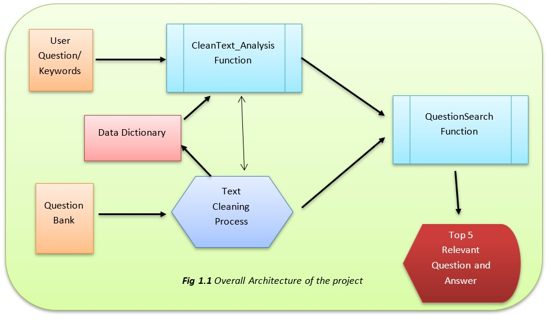

# Finding top 5 relevant question and answer based on User Input
Verdict top 5 relevant questions and answers based on user input

## Business Objective
In any website or in ecommerce business there are very few FAQ or limited user review. All the questions cannot be shown in website as website will look clumsy. Due to limited exposure of the questions, there is a possibility that user might not find question and the answer He/ She is searching for or the question is not present or never have been asked.
Considering different scenarios, we are proposing a model which will take user question and will bring out relevant top five question and answer from Question Bank.  
Our model ensures that:
- User will get relevant answer for the question he/ she is searching for 
- All the process is happening at server side and only top 5 result is achieved, website will not be clumsy.

## Problem Statment
An e-commerce company wants to build an algorithm to retrieve top 5 Question and answers based on the user given Keyword.

## Data
Data was provided in NDJson format. Data had some issues when directly inserted into R. Hence data was converted into csv in python. All other steps has been performed in R.

## Project Architecture

###	Input Layer
User Question and Question bank both are considered as input. 
-	User question/Keywords is the text or question that user will provide as an input. 
-	Question bank means the existing question and answer set that is already present. Later User question will be compared with this question bank to find relevant Question and answer.

###	 Preprocessing 
Before considering to take text as input, text needs to be cleaned. Process of cleaning text includes:
-	Removal of Stop words (common words occur in a sentence)
-	Elimination of URLs (with https or ftp [absolute URLs] and broken URLs (without https or ftp]).
-	Exclusion of emails.
-	Deletion unwanted words
-	Word spell check and correction 
-	Word stemming

#### Data Dictionary
Data dictionary was created from the step ***Word spell check and correction*** in preprocessing step. 
Function ***hunspell_suggest*** in package ***hunspell*** is used to suggest the correct word for the incorrect word. ***Jarowinkler*** distance from package ***RecordLinkage*** is also used to find out how close is the correct word compared to incorrect word. Cut off value ***0.971428571428571*** is considered. Any weight above ***0.971428571428571*** will be considered for word replacement. Manual intervention was also done to ensure the replacement of correct words. Words representing company or model name had to be manually discarded to be entering for correct spelling.Correcting incorrect model name or company name was manually done.

#### Feature Engineering
- Added new column called “QuestionTypeOE”
- Correct the misspelled words using hunspell package
- Some words are manually changed
- Create table for wrong and correct words
  - If any words are left to be corrected, they can be replaced using the Findreplace function in DataCombine package
- Add columns Question length, Question Word Count, Answer length, Answer Word Count.
- Sentiment analysis 
  - Average sentiment and standard deviation of question and answer column.
  - Replacing the Na values with median 
  - Create a column for sentiment words and there count
- Change the variables of answer type : NO to N, YES to Y, NaN to NotApp
- Create a normalize function and normalizing all the columns
- Partition of data into train and test datasets on basis of AnswerType
- sampling using the Caret package
- Choosing the accurate model

***Please refer script [01.EDA.R](Script/01.EDA.R "01.EDA.R title")***

#### Predicting AnswerType
As part of EDA, we have predicted for answertype where answer type had ***"?"*** value. Here NaN is also taken as a variable.

***Please refer script [02.EDA.R](Script/02.EDA.R "02.EDA.R title")***

#### CleanText_Analysis Function
This function has been created from steps of Preprocessing the provided data. This function is only used for user input. It also helps in correcting incorrect words using the data dictionary.

***Please refer script [04.Function For Text Analysis.R](Script/04.Function%20For%20Text%20Analysis.r "04.Function For Text Analysis.R title")***

###	Model
Model is a function ***QuestionSearch*** which computes cosine similarity between user Questions/Keywords and each Question bank to find the similar questions. 

***Please refer script [05.Model.R](Script/05.Model.r "05.Model.R title")***

###	Final Output
Final Output is the relevant question and answer shown based on the user input/keywords. Top five results will be shown with decreasing order of cosine similarity. 

***Please refer script [06.Shiny.R](Script/06.Shiny.r "06.Shiny.R title")***

